```python
%matplotlib inline
import pandas as pd
import numpy as np
import matplotlib.pyplot as plt
import scipy.stats 
import datetime
from ggplot import *
```


```python
pd.set_option('display.max_columns', 100)
```


```python
df_tw = pd.read_csv('turnstile_data_master_with_weather.csv')

y1 = df_tw.loc[(df_tw['rain'] == 0) & (df_tw['ENTRIESn_hourly'] < 6000),['ENTRIESn_hourly']] # your code here to plot a historgram for hourly entries when it is not raining
y2 = df_tw.loc[(df_tw['rain'] == 1) & (df_tw['ENTRIESn_hourly'] < 6000),['ENTRIESn_hourly']] # your code here to plot a historgram for hourly entries when it is not raining
#plt.hist(y1,30, label=['No Rain', 'Rain'])
#plt.title("Histogram of ENTRIESn_hourly")

```


```python
df_tw.head()
```


<div>
<style scoped>
    .dataframe tbody tr th:only-of-type {
        vertical-align: middle;
    }

    .dataframe tbody tr th {
        vertical-align: top;
    }

    .dataframe thead th {
        text-align: right;
    }
</style>
<table border="1" class="dataframe">
  <thead>
    <tr style="text-align: right;">
      <th></th>
      <th>Unnamed: 0</th>
      <th>UNIT</th>
      <th>DATEn</th>
      <th>TIMEn</th>
      <th>Hour</th>
      <th>DESCn</th>
      <th>ENTRIESn_hourly</th>
      <th>EXITSn_hourly</th>
      <th>maxpressurei</th>
      <th>maxdewpti</th>
      <th>mindewpti</th>
      <th>minpressurei</th>
      <th>meandewpti</th>
      <th>meanpressurei</th>
      <th>fog</th>
      <th>rain</th>
      <th>meanwindspdi</th>
      <th>mintempi</th>
      <th>meantempi</th>
      <th>maxtempi</th>
      <th>precipi</th>
      <th>thunder</th>
      <th>DATEi</th>
      <th>day_of_week</th>
      <th>day_of_week_str</th>
    </tr>
  </thead>
  <tbody>
    <tr>
      <th>0</th>
      <td>0</td>
      <td>R001</td>
      <td>2011-05-01</td>
      <td>01:00:00</td>
      <td>1</td>
      <td>REGULAR</td>
      <td>0.0</td>
      <td>0.0</td>
      <td>30.31</td>
      <td>42.0</td>
      <td>35.0</td>
      <td>30.23</td>
      <td>39.0</td>
      <td>30.27</td>
      <td>0.0</td>
      <td>0.0</td>
      <td>5.0</td>
      <td>50.0</td>
      <td>60.0</td>
      <td>69.0</td>
      <td>0.0</td>
      <td>0.0</td>
      <td>2011-05-01</td>
      <td>6</td>
      <td>Sunday</td>
    </tr>
    <tr>
      <th>1</th>
      <td>1</td>
      <td>R001</td>
      <td>2011-05-01</td>
      <td>05:00:00</td>
      <td>5</td>
      <td>REGULAR</td>
      <td>217.0</td>
      <td>553.0</td>
      <td>30.31</td>
      <td>42.0</td>
      <td>35.0</td>
      <td>30.23</td>
      <td>39.0</td>
      <td>30.27</td>
      <td>0.0</td>
      <td>0.0</td>
      <td>5.0</td>
      <td>50.0</td>
      <td>60.0</td>
      <td>69.0</td>
      <td>0.0</td>
      <td>0.0</td>
      <td>2011-05-01</td>
      <td>6</td>
      <td>Sunday</td>
    </tr>
    <tr>
      <th>2</th>
      <td>2</td>
      <td>R001</td>
      <td>2011-05-01</td>
      <td>09:00:00</td>
      <td>9</td>
      <td>REGULAR</td>
      <td>890.0</td>
      <td>1262.0</td>
      <td>30.31</td>
      <td>42.0</td>
      <td>35.0</td>
      <td>30.23</td>
      <td>39.0</td>
      <td>30.27</td>
      <td>0.0</td>
      <td>0.0</td>
      <td>5.0</td>
      <td>50.0</td>
      <td>60.0</td>
      <td>69.0</td>
      <td>0.0</td>
      <td>0.0</td>
      <td>2011-05-01</td>
      <td>6</td>
      <td>Sunday</td>
    </tr>
    <tr>
      <th>3</th>
      <td>3</td>
      <td>R001</td>
      <td>2011-05-01</td>
      <td>13:00:00</td>
      <td>13</td>
      <td>REGULAR</td>
      <td>2451.0</td>
      <td>3708.0</td>
      <td>30.31</td>
      <td>42.0</td>
      <td>35.0</td>
      <td>30.23</td>
      <td>39.0</td>
      <td>30.27</td>
      <td>0.0</td>
      <td>0.0</td>
      <td>5.0</td>
      <td>50.0</td>
      <td>60.0</td>
      <td>69.0</td>
      <td>0.0</td>
      <td>0.0</td>
      <td>2011-05-01</td>
      <td>6</td>
      <td>Sunday</td>
    </tr>
    <tr>
      <th>4</th>
      <td>4</td>
      <td>R001</td>
      <td>2011-05-01</td>
      <td>17:00:00</td>
      <td>17</td>
      <td>REGULAR</td>
      <td>4400.0</td>
      <td>2501.0</td>
      <td>30.31</td>
      <td>42.0</td>
      <td>35.0</td>
      <td>30.23</td>
      <td>39.0</td>
      <td>30.27</td>
      <td>0.0</td>
      <td>0.0</td>
      <td>5.0</td>
      <td>50.0</td>
      <td>60.0</td>
      <td>69.0</td>
      <td>0.0</td>
      <td>0.0</td>
      <td>2011-05-01</td>
      <td>6</td>
      <td>Sunday</td>
    </tr>
  </tbody>
</table>
</div>


```python
df_tw['DATEi'] = pd.to_datetime(df_tw.DATEn)
df_tw['day_of_week'] = df_tw.DATEi.dt.weekday #Monday is 0 and Sunday is 6
df_tw['day_of_week_name'] = df_tw.DATEi.dt.weekday_name
```


```python
print(list(df_tw.columns).index('UNIT'),list(df_tw.columns).index('DATEn'),list(df_tw.columns).index('TIMEn'))
print(list(df_tw.columns).index('ENTRIESn_hourly'))
print(list(df_tw.columns).index('fog'),list(df_tw.columns).index('rain'))
print(len(list(df_tw.columns)))
```

    1 2 3
    6
    14 15
    27


```python
df_tw.columns
```


    Index(['Unnamed: 0', 'UNIT', 'DATEn', 'TIMEn', 'Hour', 'DESCn',
           'ENTRIESn_hourly', 'EXITSn_hourly', 'maxpressurei', 'maxdewpti',
           'mindewpti', 'minpressurei', 'meandewpti', 'meanpressurei', 'fog',
           'rain', 'meanwindspdi', 'mintempi', 'meantempi', 'maxtempi', 'precipi',
           'thunder'],
          dtype='object')


```python
type(y1.values)
```


    numpy.ndarray


```python
fig = plt.figure()
ax = fig.add_subplot(111)
ax.hist(y1.values,bins = 30)
ax.hist(y2.values,bins = 30)
```


    (array([19656.,  4913.,  3261.,  2391.,  1962.,  1573.,  1135.,   975.,
              832.,   680.,   538.,   565.,   454.,   444.,   396.,   380.,
              308.,   259.,   220.,   211.,   202.,   202.,   171.,   158.,
              142.,   123.,   104.,   104.,   109.,   100.]),
     array([   0.        ,  199.93333333,  399.86666667,  599.8       ,
             799.73333333,  999.66666667, 1199.6       , 1399.53333333,
            1599.46666667, 1799.4       , 1999.33333333, 2199.26666667,
            2399.2       , 2599.13333333, 2799.06666667, 2999.        ,
            3198.93333333, 3398.86666667, 3598.8       , 3798.73333333,
            3998.66666667, 4198.6       , 4398.53333333, 4598.46666667,
            4798.4       , 4998.33333333, 5198.26666667, 5398.2       ,
            5598.13333333, 5798.06666667, 5998.        ]),
     <a list of 30 Patch objects>)


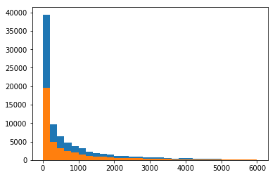


```python
plt.figure()
plt.hist([y1.values,y2.values], bins=30, color = ['lightpink','skyblue'],alpha=0.7, ec='None',  stacked=True, label = ['No Rain', 'Rain'])
plt.xlabel('ENTRIESn_hourly')
plt.ylabel('Frenquency')
plt.title('Histogram of ENTRIESn_hourly')
plt.legend(frameon=False)

```


    <matplotlib.legend.Legend at 0x10e019b00>


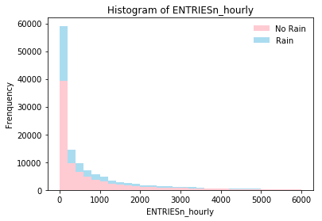


```python
y1_all = df_tw.loc[(df_tw['rain'] == 0) ,['ENTRIESn_hourly']] # your code here to plot a historgram for hourly entries when it is not raining
y2_all = df_tw.loc[(df_tw['rain'] == 1) ,['ENTRIESn_hourly']] # your code here to plot a historgram for hourly entries when it is not raining
with_rain_mean = np.mean(y2_all.values)
without_rain_mean = np.mean(y1_all.values)
(U, p) = scipy.stats.mannwhitneyu(y1_all.values,y2_all.values)
print(U,p)
```

    1924409167.0 0.024940392294493356


```python
df_tw.describe()
```


<div>
<style scoped>
    .dataframe tbody tr th:only-of-type {
        vertical-align: middle;
    }

    .dataframe tbody tr th {
        vertical-align: top;
    }

    .dataframe thead th {
        text-align: right;
    }
</style>
<table border="1" class="dataframe">
  <thead>
    <tr style="text-align: right;">
      <th></th>
      <th>Unnamed: 0</th>
      <th>Hour</th>
      <th>ENTRIESn_hourly</th>
      <th>EXITSn_hourly</th>
      <th>maxpressurei</th>
      <th>maxdewpti</th>
      <th>mindewpti</th>
      <th>minpressurei</th>
      <th>meandewpti</th>
      <th>meanpressurei</th>
      <th>fog</th>
      <th>rain</th>
      <th>meanwindspdi</th>
      <th>mintempi</th>
      <th>meantempi</th>
      <th>maxtempi</th>
      <th>precipi</th>
      <th>thunder</th>
    </tr>
  </thead>
  <tbody>
    <tr>
      <th>count</th>
      <td>131951.000000</td>
      <td>131951.000000</td>
      <td>131951.000000</td>
      <td>131951.000000</td>
      <td>131951.000000</td>
      <td>131951.000000</td>
      <td>131951.000000</td>
      <td>131951.000000</td>
      <td>131951.000000</td>
      <td>131951.000000</td>
      <td>131951.000000</td>
      <td>131951.000000</td>
      <td>131951.000000</td>
      <td>131951.000000</td>
      <td>131951.000000</td>
      <td>131951.000000</td>
      <td>131951.000000</td>
      <td>131951.0</td>
    </tr>
    <tr>
      <th>mean</th>
      <td>65975.000000</td>
      <td>10.896158</td>
      <td>1095.348478</td>
      <td>886.890838</td>
      <td>30.031894</td>
      <td>57.241302</td>
      <td>48.259013</td>
      <td>29.892714</td>
      <td>52.703526</td>
      <td>29.965077</td>
      <td>0.167100</td>
      <td>0.334245</td>
      <td>5.543065</td>
      <td>56.169775</td>
      <td>64.269729</td>
      <td>71.769968</td>
      <td>0.172276</td>
      <td>0.0</td>
    </tr>
    <tr>
      <th>std</th>
      <td>38091.117022</td>
      <td>6.892084</td>
      <td>2337.015421</td>
      <td>2008.604886</td>
      <td>0.125689</td>
      <td>8.770891</td>
      <td>11.305312</td>
      <td>0.146384</td>
      <td>9.943590</td>
      <td>0.130461</td>
      <td>0.373066</td>
      <td>0.471728</td>
      <td>1.982441</td>
      <td>6.338875</td>
      <td>6.568289</td>
      <td>7.627218</td>
      <td>0.429005</td>
      <td>0.0</td>
    </tr>
    <tr>
      <th>min</th>
      <td>0.000000</td>
      <td>0.000000</td>
      <td>0.000000</td>
      <td>0.000000</td>
      <td>29.740000</td>
      <td>39.000000</td>
      <td>22.000000</td>
      <td>29.540000</td>
      <td>31.000000</td>
      <td>29.640000</td>
      <td>0.000000</td>
      <td>0.000000</td>
      <td>1.000000</td>
      <td>46.000000</td>
      <td>55.000000</td>
      <td>58.000000</td>
      <td>0.000000</td>
      <td>0.0</td>
    </tr>
    <tr>
      <th>25%</th>
      <td>32987.500000</td>
      <td>5.000000</td>
      <td>39.000000</td>
      <td>32.000000</td>
      <td>29.960000</td>
      <td>50.000000</td>
      <td>38.000000</td>
      <td>29.840000</td>
      <td>45.000000</td>
      <td>29.910000</td>
      <td>0.000000</td>
      <td>0.000000</td>
      <td>5.000000</td>
      <td>52.000000</td>
      <td>60.000000</td>
      <td>65.000000</td>
      <td>0.000000</td>
      <td>0.0</td>
    </tr>
    <tr>
      <th>50%</th>
      <td>65975.000000</td>
      <td>12.000000</td>
      <td>279.000000</td>
      <td>232.000000</td>
      <td>30.030000</td>
      <td>57.000000</td>
      <td>51.000000</td>
      <td>29.910000</td>
      <td>54.000000</td>
      <td>29.960000</td>
      <td>0.000000</td>
      <td>0.000000</td>
      <td>5.000000</td>
      <td>54.000000</td>
      <td>63.000000</td>
      <td>71.000000</td>
      <td>0.000000</td>
      <td>0.0</td>
    </tr>
    <tr>
      <th>75%</th>
      <td>98962.500000</td>
      <td>17.000000</td>
      <td>1109.000000</td>
      <td>847.000000</td>
      <td>30.100000</td>
      <td>64.000000</td>
      <td>55.000000</td>
      <td>29.970000</td>
      <td>60.000000</td>
      <td>30.050000</td>
      <td>0.000000</td>
      <td>1.000000</td>
      <td>6.000000</td>
      <td>60.000000</td>
      <td>68.000000</td>
      <td>78.000000</td>
      <td>0.100000</td>
      <td>0.0</td>
    </tr>
    <tr>
      <th>max</th>
      <td>131950.000000</td>
      <td>23.000000</td>
      <td>51839.000000</td>
      <td>45249.000000</td>
      <td>30.310000</td>
      <td>70.000000</td>
      <td>66.000000</td>
      <td>30.230000</td>
      <td>68.000000</td>
      <td>30.270000</td>
      <td>1.000000</td>
      <td>1.000000</td>
      <td>12.000000</td>
      <td>70.000000</td>
      <td>78.000000</td>
      <td>86.000000</td>
      <td>2.180000</td>
      <td>0.0</td>
    </tr>
  </tbody>
</table>
</div>


```python
plt.subplot(1,3,1)
plt.plot(df_tw.ENTRIESn_hourly, df_tw.day_of_week_name,'.')
plt.subplot(1,3,2)
plt.plot(df_tw.ENTRIESn_hourly, df_tw.Hour,'.')
plt.subplot(1,3,3)
plt.plot(df_tw.ENTRIESn_hourly, df_tw.meantempi,'.')
```


    [<matplotlib.lines.Line2D at 0x126936630>]


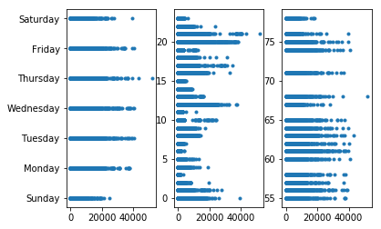


```python
plt.figure(figsize=(15,2))
plt.subplot(1,3,1)
plt.plot(df_tw.maxtempi, df_tw.ENTRIESn_hourly,'.')
plt.subplot(1,3,2)
plt.plot(df_tw.mintempi, df_tw.ENTRIESn_hourly,'.')
plt.subplot(1,3,3)
plt.plot(df_tw.meantempi, df_tw.ENTRIESn_hourly,'.')
```


    [<matplotlib.lines.Line2D at 0x120548e10>]


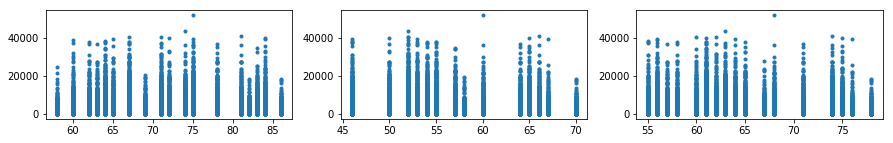


```python
plt.figure(figsize=(15,2))
plt.subplot(1,3,1)
plt.plot(df_tw.maxpressurei, df_tw.ENTRIESn_hourly,'.')
plt.subplot(1,3,2)
plt.plot(df_tw.minpressurei, df_tw.ENTRIESn_hourly,'.')
plt.subplot(1,3,3)
plt.plot(df_tw.meanpressurei, df_tw.ENTRIESn_hourly,'.')
```


    [<matplotlib.lines.Line2D at 0x121479ef0>]


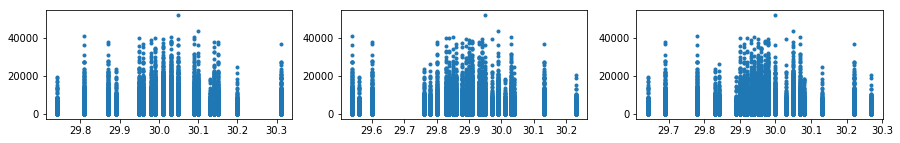


```python
plt.figure(figsize=(15,2))
plt.subplot(1,3,1)
plt.plot(df_tw.maxdewpti, df_tw.ENTRIESn_hourly,'.')
plt.subplot(1,3,2)
plt.plot(df_tw.mindewpti, df_tw.ENTRIESn_hourly,'.')
plt.subplot(1,3,3)
plt.plot(df_tw.meandewpti, df_tw.ENTRIESn_hourly,'.')
```


    [<matplotlib.lines.Line2D at 0x1222044a8>]


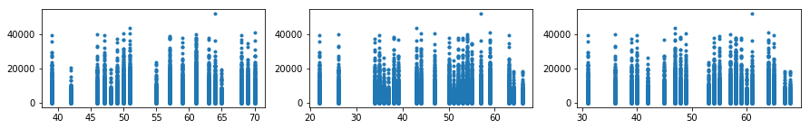


```python
plt.figure(figsize=(15,2))
plt.subplot(1,3,1)
plt.plot(df_tw.rain, df_tw.ENTRIESn_hourly,'.')
plt.subplot(1,3,2)
plt.plot(df_tw.fog, df_tw.ENTRIESn_hourly,'.')
plt.subplot(1,3,3)
plt.plot(df_tw.precipi, df_tw.ENTRIESn_hourly,'.')
```


    [<matplotlib.lines.Line2D at 0x123d2e198>]


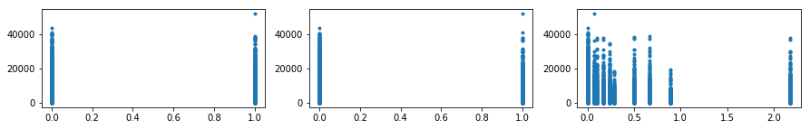


```python
# predictions of ridership per hour
```


```python
import numpy as np
import pandas
from ggplot import *
import scipy
import matplotlib.pyplot as plt

"""
In this question, you need to:
1) implement the compute_cost() and gradient_descent() procedures
2) Select features (in the predictions procedure) and make predictions.

"""

def normalize_features(df):
    """
    Normalize the features in the data set.
    """
    mu = df.mean()
    sigma = df.std()
    
    if (sigma == 0).any():
        raise Exception("One or more features had the same value for all samples, and thus could " + \
                         "not be normalized. Please do not include features with only a single value " + \
                         "in your model.")
    df_normalized = (df - df.mean()) / df.std()

    return df_normalized, mu, sigma

def compute_cost(features, values, theta):
    """
    Compute the cost function given a set of features / values, 
    and the values for our thetas.
    """
    
    # your code here
    m = len(values)
    sum_squared_errors = sum(np.square( np.dot(features, theta) - values))
    cost = sum_squared_errors/(2*m)
    
    return cost

def gradient_descent(features, values, theta, alpha, num_iterations):
    """
    Perform gradient descent given a data set with an arbitrary number of features.
    """
    
    m = len(values)
    cost_history = []

    for i in range(num_iterations):
        # your code here
        pre_y = np.dot(features, theta)
        theta += alpha/m * np.dot((values - pre_y), features)
        cost = compute_cost(features, values, theta)
        cost_history.append(cost)
    return theta, pandas.Series(cost_history)

def predictions(dataframe, alpha=0.1, num_iterations=30):
    '''
    The NYC turnstile data is stored in a pandas dataframe called weather_turnstile.
    Using the information stored in the dataframe, let's predict the ridership of
    the NYC subway using linear regression with gradient descent.
    
    You can download the complete turnstile weather dataframe here:
    https://www.dropbox.com/s/meyki2wl9xfa7yk/turnstile_data_master_with_weather.csv    
    
    Your prediction should have a R^2 value of 0.40 or better.
    You need to experiment using various input features contained in the dataframe. 
    We recommend that you don't use the EXITSn_hourly feature as an input to the 
    linear model because we cannot use it as a predictor: we cannot use exits 
    counts as a way to predict entry counts. 
    
    Note: Due to the memory and CPU limitation of our Amazon EC2 instance, we will
    give you a random subet (~15%) of the data contained in 
    turnstile_data_master_with_weather.csv. You are encouraged to experiment with 
    this computer on your own computer, locally. 
    
    
    If you'd like to view a plot of your cost history, uncomment the call to 
    plot_cost_history below. The slowdown from plotting is significant, so if you 
    are timing out, the first thing to do is to comment out the plot command again.
    
    If you receive a "server has encountered an error" message, that means you are 
    hitting the 30-second limit that's placed on running your program. Try using a 
    smaller number for num_iterations if that's the case.
    
    If you are using your own algorithm/models, see if you can optimize your code so 
    that it runs faster.
    '''
    # Select Features (try different features!)
    #features = dataframe[['rain', 'precipi', 'Hour', 'meantempi','fog', 'meandewpti', 'meanpressurei']]
    features = dataframe[['Hour', 'maxpressurei', 'maxdewpti', 'mindewpti', \
                          'minpressurei', 'meandewpti', 'meanpressurei', 'fog',\
                          'rain', 'meanwindspdi', 'mintempi', 'meantempi', 'maxtempi', 'precipi']]
    
    dummy_day_of_week = pandas.get_dummies(dataframe['day_of_week'], prefix = 'dow')
    features = features.join(dummy_day_of_week)
    
    # Add UNIT to features using dummy variables
    dummy_units = pandas.get_dummies(dataframe['UNIT'], prefix='unit')
    features = features.join(dummy_units)
    
    # Values
    values = dataframe['ENTRIESn_hourly']
    m = len(values)

    features, mu, sigma = normalize_features(features)
    features['ones'] = np.ones(m) # Add a column of 1s (y intercept)
    
    # Convert features and values to numpy arrays
    features_array = np.array(features)
    values_array = np.array(values)

    # Set values for alpha, number of iterations.
    #change to be input parameters
    #alpha = 0.1 # please feel free to change this value
    #num_iterations = 50 # please feel free to change this value

    # Initialize theta, perform gradient descent
    theta_gradient_descent = np.zeros(len(features.columns))
    theta_gradient_descent, cost_history = gradient_descent(features_array, 
                                                            values_array, 
                                                            theta_gradient_descent, 
                                                            alpha, 
                                                            num_iterations)
    
    #plot = None
    # -------------------------------------------------
    # Uncomment the next line to see your cost history
    # -------------------------------------------------
    
    plot = plot_cost_history(alpha, cost_history)
    # 
    # Please note, there is a possibility that plotting
    # this in addition to your calculation will exceed 
    # the 30 second limit on the compute servers.
    
    predictions = np.dot(features_array, theta_gradient_descent)
    return predictions, plot

def plot_cost_history(alpha, cost_history):
    """
       This function is for viewing the plot of your cost history.
       You can run it by uncommenting this

           plot_cost_history(alpha, cost_history) 

       call in predictions.

       If you want to run this locally, you should print the return value
       from this function.
    """

    #cost_history = np.array(cost_history)
    #print(type(cost_history))
    
    cost_df = pandas.DataFrame({'Cost_History': cost_history,'Iteration': range(len(cost_history))})
    
    return (ggplot(cost_df, aes('Iteration', 'Cost_History')) + \
          geom_point() + ggtitle('Cost History for alpha = %.3f' % alpha ))
    

def plot_residuals(values, predictions):
    '''
    Using the same methods that we used to plot a histogram of entries
    per hour for our data, why don't you make a histogram of the residuals
    (that is, the difference between the original hourly entry data and the predicted values).
    Try different binwidths for your histogram.

    Based on this residual histogram, do you have any insight into how our model
    performed?  Reading a bit on this webpage might be useful:

    http://www.itl.nist.gov/div898/handbook/pri/section2/pri24.htm
    '''
    
    plt.figure()
    plt.hist(values - predictions)
    return plt

def compute_r_squared(values, predictions):
    '''
    In exercise 5, we calculated the R^2 value for you. But why don't you try and
    and calculate the R^2 value yourself.
    
    Given a list of original data points, and also a list of predicted data points,
    write a function that will compute and return the coefficient of determination (R^2)
    for this data.  numpy.mean() and numpy.sum() might both be useful here, but
    not necessary.

    Documentation about numpy.mean() and numpy.sum() below:
    http://docs.scipy.org/doc/numpy/reference/generated/numpy.mean.html
    http://docs.scipy.org/doc/numpy/reference/generated/numpy.sum.html
    '''
    
    # your code here
    
    r_squared = 1- ((values - predictions)**2).sum()/((values-np.mean(values))**2).sum()
    return r_squared
```


```python
values = np.array(df_tw['ENTRIESn_hourly'])
```


```python
pre, plot = predictions(df_tw, alpha = .1, num_iterations=40)
```


```python
plot
```


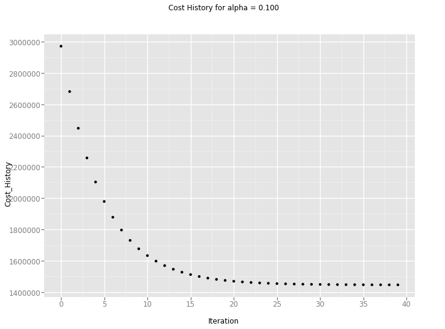


    <ggplot: (291271628)>


```python
plot_residuals(values, pre)
```


    <module 'matplotlib.pyplot' from '/usr/local/lib/python3.6/site-packages/matplotlib/pyplot.py'>


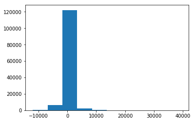


```python
compute_r_squared(values, pre)
```


    0.47047395806196757


```python
import statsmodels.api as sm
features = df_tw[['Hour', 'day_of_week','maxpressurei', 'maxdewpti', 'mindewpti', \
                          'minpressurei', 'meandewpti', 'meanpressurei', 'fog',\
                          'rain', 'meanwindspdi', 'mintempi', 'meantempi', 'maxtempi', 'precipi']]
# features = df_tw[['Hour', 'meandewpti', 'meanpressurei', 'fog',\
#                           'rain', 'meanwindspdi', 'meantempi','maxtempi', 'precipi']]

dummy_day_of_week = pandas.get_dummies(df_tw['day_of_week'], prefix = 'dow')
features = features.join(dummy_day_of_week)
            
    # Add UNIT to features using dummy variables
dummy_units = pandas.get_dummies(df_tw['UNIT'], prefix='unit')
features = features.join(dummy_units)
features = sm.add_constant(features)   
    # Values
values = df_tw['ENTRIESn_hourly']
    
model = sm.OLS(values,features)
results = model.fit()
```


```python
results.rsquared
```


    0.47107366960217856


```python
df_sum = df_tw[['day_of_week','ENTRIESn_hourly']].groupby('day_of_week', as_index=False).agg(np.mean)
#df_sum['day_of_week'] = ['Monday', 'Tuesday', 'Wednesday', 'Thursday', 'Friday', 'Saturday', 'Sunday']
print(df_sum)
```

       day_of_week  ENTRIESn_hourly
    0            0      1084.888769
    1            1      1307.073259
    2            2      1335.901803
    3            3      1305.176382
    4            4      1333.800773
    5            5       809.925317
    6            6       604.620120


```python
df_sum.columns
```


    Index(['day_of_week', 'ENTRIESn_hourly'], dtype='object')


```python
gg = ggplot(df_sum, aes(x = 'day_of_week', weight = 'ENTRIESn_hourly')) \
    + geom_bar(facecolor='blue', fill='blue', alpha=0.3)\
    + ggtitle('Ridership by day of weel') + xlab('Day') + ylab('Total Entries')\
    + scale_x_discrete(labels=(['Monday', 'Tuesday', 'Wednesday', 'Thursday', 'Friday', 'Saturday', 'Sunday']))
print(gg)
```


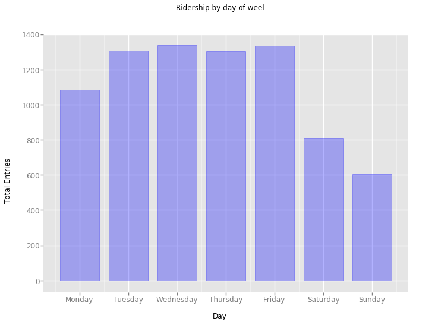


    <ggplot: (-9223372036474094932)>


```python
df_sum = df_tw[['day_of_week_name','ENTRIESn_hourly']].groupby('day_of_week_name', as_index=False).agg(np.mean)
df_sum
```


<div>
<style scoped>
    .dataframe tbody tr th:only-of-type {
        vertical-align: middle;
    }

    .dataframe tbody tr th {
        vertical-align: top;
    }

    .dataframe thead th {
        text-align: right;
    }
</style>
<table border="1" class="dataframe">
  <thead>
    <tr style="text-align: right;">
      <th></th>
      <th>day_of_week_name</th>
      <th>ENTRIESn_hourly</th>
    </tr>
  </thead>
  <tbody>
    <tr>
      <th>0</th>
      <td>Friday</td>
      <td>1333.800773</td>
    </tr>
    <tr>
      <th>1</th>
      <td>Monday</td>
      <td>1084.888769</td>
    </tr>
    <tr>
      <th>2</th>
      <td>Saturday</td>
      <td>809.925317</td>
    </tr>
    <tr>
      <th>3</th>
      <td>Sunday</td>
      <td>604.620120</td>
    </tr>
    <tr>
      <th>4</th>
      <td>Thursday</td>
      <td>1305.176382</td>
    </tr>
    <tr>
      <th>5</th>
      <td>Tuesday</td>
      <td>1307.073259</td>
    </tr>
    <tr>
      <th>6</th>
      <td>Wednesday</td>
      <td>1335.901803</td>
    </tr>
  </tbody>
</table>
</div>


```python
weekdays = ['Monday', 'Tuesday', 'Wednesday', 'Thursday', 'Friday', 'Saturday', 'Sunday']
mapping = {day: i for i, day in enumerate(weekdays)}
key = df_sum['day_of_week_name'].map(mapping)
df_sum = df_sum.iloc[key.argsort()]
df_sum
```


<div>
<style scoped>
    .dataframe tbody tr th:only-of-type {
        vertical-align: middle;
    }

    .dataframe tbody tr th {
        vertical-align: top;
    }

    .dataframe thead th {
        text-align: right;
    }
</style>
<table border="1" class="dataframe">
  <thead>
    <tr style="text-align: right;">
      <th></th>
      <th>day_of_week_name</th>
      <th>ENTRIESn_hourly</th>
    </tr>
  </thead>
  <tbody>
    <tr>
      <th>1</th>
      <td>Monday</td>
      <td>1084.888769</td>
    </tr>
    <tr>
      <th>5</th>
      <td>Tuesday</td>
      <td>1307.073259</td>
    </tr>
    <tr>
      <th>6</th>
      <td>Wednesday</td>
      <td>1335.901803</td>
    </tr>
    <tr>
      <th>4</th>
      <td>Thursday</td>
      <td>1305.176382</td>
    </tr>
    <tr>
      <th>0</th>
      <td>Friday</td>
      <td>1333.800773</td>
    </tr>
    <tr>
      <th>2</th>
      <td>Saturday</td>
      <td>809.925317</td>
    </tr>
    <tr>
      <th>3</th>
      <td>Sunday</td>
      <td>604.620120</td>
    </tr>
  </tbody>
</table>
</div>


```python
df_tw['Increase_hourly'] = df_tw['ENTRIESn_hourly']-df_tw['EXITSn_hourly']
df_sum_h = df_tw[['Hour','ENTRIESn_hourly','EXITSn_hourly']].groupby('Hour', as_index = False).agg(np.mean)
#df_sum_h

gg_h = ggplot(df_sum_h, aes('Hour', weight = 'ENTRIESn_hourly')) +geom_bar(facecolor = 'blue', fill = 'blue', alpha = .5)
print(gg_h)
```


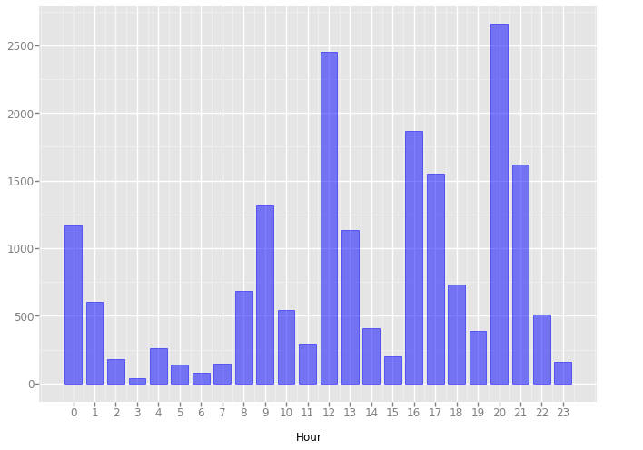


    <ggplot: (-9223372036563001235)>


```python
df_sum_h = df_tw[['Hour','Increase_hourly']].groupby('Hour', as_index = False).agg(np.mean)
#df_sum_h

gg_h = ggplot(df_sum_h, aes('Hour', weight = 'Increase_hourly')) + geom_bar(facecolor = 'blue', fill = 'blue', alpha = .5)
print(gg_h)
```


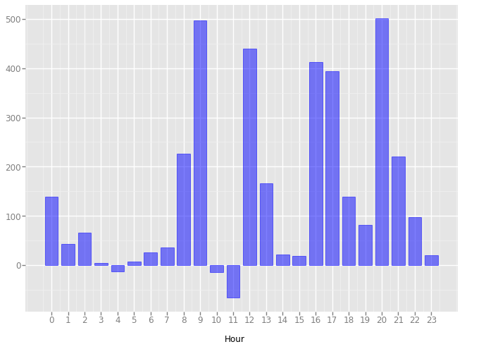


    <ggplot: (-9223372036480434025)>


```python
plot = ggplot(df_sum_h, aes(x='Hour',y='Increase_hourly')) \
        + geom_point(size=df_sum_h['Increase_hourly'].abs()) \
        + xlim(-0.2,23.2) + ylab('Increase_hourly') + ggtitle('Total Increase_hourly By Hour')
print( plot)
```


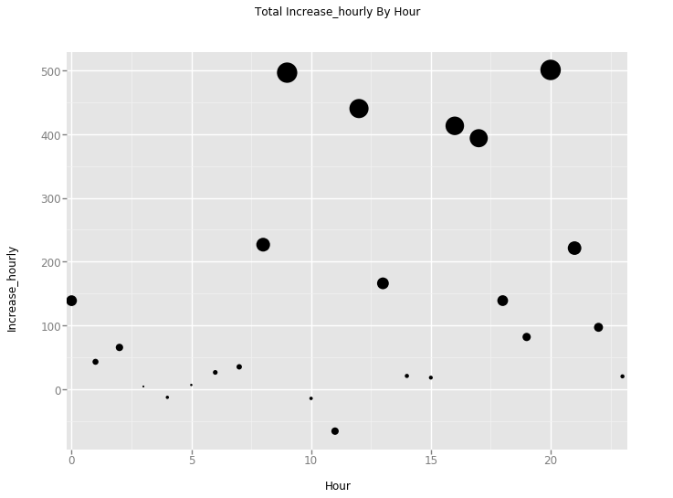


    <ggplot: (-9223372036518006468)>


```python
df_sum_h = df_tw[['UNIT','ENTRIESn_hourly','EXITSn_hourly']].groupby('UNIT', as_index = False).agg(np.mean)
#df_sum_h.describe
```


```python
gg_h = ggplot(df_sum_h, aes('UNIT', weight = 'ENTRIESn_hourly')) +geom_bar(facecolor = 'blue', fill = 'blue', alpha = .5)
print(gg_h)
gg_h = ggplot(df_sum_h, aes('UNIT', weight = 'EXITSn_hourly')) +geom_bar(facecolor = 'blue', fill = 'blue', alpha = .5)
print(gg_h)
```


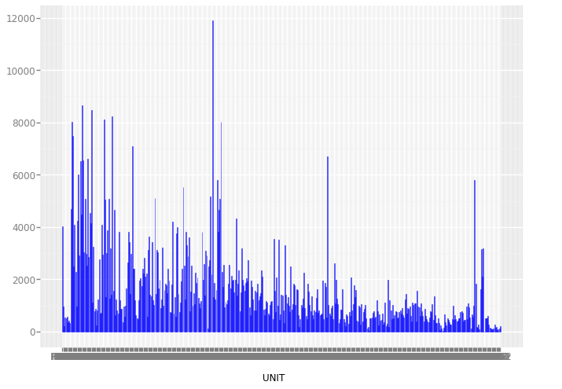


    <ggplot: (-9223372036467754741)>


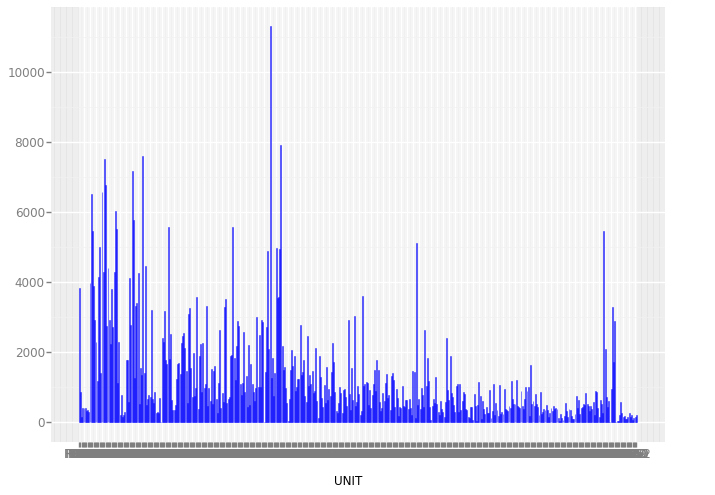


    <ggplot: (-9223372036545099383)>


```python
# Mapreduce exercise
## Ridership per station
```


```python
import sys
import string
import logging

from util import mapper_logfile
logging.basicConfig(filename=mapper_logfile, format='%(message)s',
                    level=logging.INFO, filemode='w')

def mapper():
    """
    In this exercise, for each turnstile unit, you will determine the date and time 
    (in the span of this data set) at which the most people entered through the unit.
    
    The input to the mapper will be the final Subway-MTA dataset, the same as
    in the previous exercise. You can check out the csv and its structure below:
    https://s3.amazonaws.com/content.udacity-data.com/courses/ud359/turnstile_data_master_with_weather.csv

    For each line, the mapper should return the UNIT, ENTRIESn_hourly, DATEn, and 
    TIMEn columns, separated by tabs. For example:
    'R001\t100000.0\t2011-05-01\t01:00:00'

    Since you are printing the output of your program, printing a debug 
    statement will interfere with the operation of the grader. Instead, 
    use the logging module, which we've configured to log to a file printed 
    when you click "Test Run". For example:
    logging.info("My debugging message")
    Note that, unlike print, logging.info will take only a single argument.
    So logging.info("my message") will work, but logging.info("my","message") will not.
    """
    
    for line in sys.stdin:
        # your code here
        data = line.strip().split(',')

        if len(data) != 22 or data[1] == 'UNIT':
            continue
            
        print('{}\t{}\t{}\t{}'.format(data[1], data[6], data[2], data[3]))

mapper()

import sys
import logging

from util import reducer_logfile
logging.basicConfig(filename=reducer_logfile, format='%(message)s',
                    level=logging.INFO, filemode='w')

def reducer():
    '''
    Write a reducer that will compute the busiest date and time (that is, the 
    date and time with the most entries) for each turnstile unit. Ties should 
    be broken in favor of datetimes that are later on in the month of May. You 
    may assume that the contents of the reducer will be sorted so that all entries 
    corresponding to a given UNIT will be grouped together.
    
    The reducer should print its output with the UNIT name, the datetime (which 
    is the DATEn followed by the TIMEn column, separated by a single space), and 
    the number of entries at this datetime, separated by tabs.

    For example, the output of the reducer should look like this:
    R001    2011-05-11 17:00:00	   31213.0
    R002	2011-05-12 21:00:00	   4295.0
    R003	2011-05-05 12:00:00	   995.0
    R004	2011-05-12 12:00:00	   2318.0
    R005	2011-05-10 12:00:00	   2705.0
    R006	2011-05-25 12:00:00	   2784.0
    R007	2011-05-10 12:00:00	   1763.0
    R008	2011-05-12 12:00:00	   1724.0
    R009	2011-05-05 12:00:00	   1230.0
    R010	2011-05-09 18:00:00	   30916.0
    ...
    
    
    
    cur_key = None
    max_e = [None, None, 0]

    for line in sys.stdin:
        # your code here
        data = line.strip().split('\t')

        if len(data) != 4:
            continue

        new_key, count, date, time = data
        
        if cur_key == None:
            cur_key = new_key
        elif cur_key != new_key:
            print('{}\t{} {}\t{}'.format(cur_key, max_e[0], max_e[1], max_e[2]))
            cur_key = new_key
            max_e = [None, None, 0.0]
 
        if float(count) >= max_e[2]:
            max_e = [date, time, float(count)]
            
    if cur_key != None:        
        print('{}\t{} {}\t{}'.format(cur_key, max_e[0], max_e[1], max_e[2]))
        
            
reducer()

```


```python
## Ridership by weather
```


```python
import sys
import string
import logging

from util import mapper_logfile
logging.basicConfig(filename=mapper_logfile, format='%(message)s',
                    level=logging.INFO, filemode='w')

def mapper():
    '''
    For this exercise, compute the average value of the ENTRIESn_hourly column 
    for different weather types. Weather type will be defined based on the 
    combination of the columns fog and rain (which are boolean values).
    For example, one output of our reducer would be the average hourly entries 
    across all hours when it was raining but not foggy.

    Each line of input will be a row from our final Subway-MTA dataset in csv format.
    You can check out the input csv file and its structure below:
    https://s3.amazonaws.com/content.udacity-data.com/courses/ud359/turnstile_data_master_with_weather.csv
    
    Note that this is a comma-separated file.

    This mapper should PRINT (not return) the weather type as the key (use the 
    given helper function to format the weather type correctly) and the number in 
    the ENTRIESn_hourly column as the value. They should be separated by a tab.
    For example: 'fog-norain\t12345'
    
    '''

    # Takes in variables indicating whether it is foggy and/or rainy and
    # returns a formatted key that you should output.  The variables passed in
    # can be booleans, ints (0 for false and 1 for true) or floats (0.0 for
    # false and 1.0 for true), but the strings '0.0' and '1.0' will not work,
    # so make sure you convert these values to an appropriate type before
    # calling the function.
    def format_key(fog, rain):
        return '{}fog-{}rain'.format(
            '' if fog else 'no',
            '' if rain else 'no'
        )
    
    for line in sys.stdin:
    	# your code here
    	reader = line.strip().split(",")
    	if len(reader) != 22 or reader[1] == 'UNIT':
    	    continue
    	fog, rain, entries_h = reader[14], reader[15], reader[6]
    	key = format_key(float(fog), float(rain))
    	print('{}\t{}'.format(key, entries_h))

mapper()

import sys
import logging

from util import reducer_logfile
logging.basicConfig(filename=reducer_logfile, format='%(message)s',
                    level=logging.INFO, filemode='w')

def reducer():
    '''
    Given the output of the mapper for this assignment, the reducer should
    print one row per weather type, along with the average value of
    ENTRIESn_hourly for that weather type, separated by a tab. You can assume
    that the input to the reducer will be sorted by weather type, such that all
    entries corresponding to a given weather type will be grouped together.

    In order to compute the average value of ENTRIESn_hourly, you'll need to
    keep track of both the total riders per weather type and the number of
    hours with that weather type. That's why we've initialized the variable 
    riders and num_hours below. Feel free to use a different data structure in 
    your solution, though.

    An example output row might look like this:
    'fog-norain\t1105.32467557'

    '''

    riders = 0      # The number of total riders for this key
    num_hours = 0   # The number of hours with this key
    cur_key = None

    for line in sys.stdin:
        # your code here
        reader = line.strip().split("\t")
        if len(reader) != 2:
            continue
        new_key, count = reader
        if cur_key == None:
            cur_key = new_key
        elif cur_key != new_key:
            entries_h_avg = riders/float(num_hours)
            print('{}\t{}'.format(cur_key, entries_h_avg))
            cur_key = new_key
            num_hours = 0
            riders = 0
        num_hours += 1
        riders += float(count)
        
    if cur_key != None:
        entries_h_avg = riders/float(num_hours)
        print('{}\t{}'.format(cur_key, entries_h_avg))
        

reducer()


```


```python
## busiest hours
```


```python
import sys
import string
import logging

from util import mapper_logfile
logging.basicConfig(filename=mapper_logfile, format='%(message)s',
                    level=logging.INFO, filemode='w')

def mapper():
    """
    In this exercise, for each turnstile unit, you will determine the date and time 
    (in the span of this data set) at which the most people entered through the unit.
    
    The input to the mapper will be the final Subway-MTA dataset, the same as
    in the previous exercise. You can check out the csv and its structure below:
    https://s3.amazonaws.com/content.udacity-data.com/courses/ud359/turnstile_data_master_with_weather.csv

    For each line, the mapper should return the UNIT, ENTRIESn_hourly, DATEn, and 
    TIMEn columns, separated by tabs. For example:
    'R001\t100000.0\t2011-05-01\t01:00:00'

    """
    
    for line in sys.stdin:
        # your code here
        data = line.strip().split(',')

        if len(data) != 22 or data[1] == 'UNIT':
            continue
            
        print('{}\t{}\t{}\t{}'.format(data[1], data[6], data[2], data[3]))

mapper()


import sys
import logging

from util import reducer_logfile
logging.basicConfig(filename=reducer_logfile, format='%(message)s',
                    level=logging.INFO, filemode='w')

def reducer():
    '''
    Write a reducer that will compute the busiest date and time (that is, the 
    date and time with the most entries) for each turnstile unit. Ties should 
    be broken in favor of datetimes that are later on in the month of May. You 
    may assume that the contents of the reducer will be sorted so that all entries 
    corresponding to a given UNIT will be grouped together.
    
    The reducer should print its output with the UNIT name, the datetime (which 
    is the DATEn followed by the TIMEn column, separated by a single space), and 
    the number of entries at this datetime, separated by tabs.

    For example, the output of the reducer should look like this:
    R001    2011-05-11 17:00:00	   31213.0
    R002	2011-05-12 21:00:00	   4295.0
    R003	2011-05-05 12:00:00	   995.0
    R004	2011-05-12 12:00:00	   2318.0
    R005	2011-05-10 12:00:00	   2705.0
    R006	2011-05-25 12:00:00	   2784.0
    R007	2011-05-10 12:00:00	   1763.0
    R008	2011-05-12 12:00:00	   1724.0
    R009	2011-05-05 12:00:00	   1230.0
    R010	2011-05-09 18:00:00	   30916.0
    ...
    ...

    '''
    
    
    cur_key = None
    max_e = [None, None, 0]

    for line in sys.stdin:
        # your code here
        data = line.strip().split('\t')

        if len(data) != 4:
            continue

        new_key, count, date, time = data
        
        if cur_key == None:
            cur_key = new_key
        elif cur_key != new_key:
            print('{}\t{} {}\t{}'.format(cur_key, max_e[0], max_e[1], max_e[2]))
            cur_key = new_key
            max_e = [None, None, 0.0]
 
        if float(count) >= max_e[2]:
            max_e = [date, time, float(count)]
            
    if cur_key != None:        
        print('{}\t{} {}\t{}'.format(cur_key, max_e[0], max_e[1], max_e[2]))
        
            
reducer()

```
